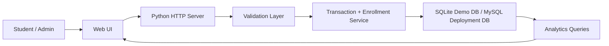
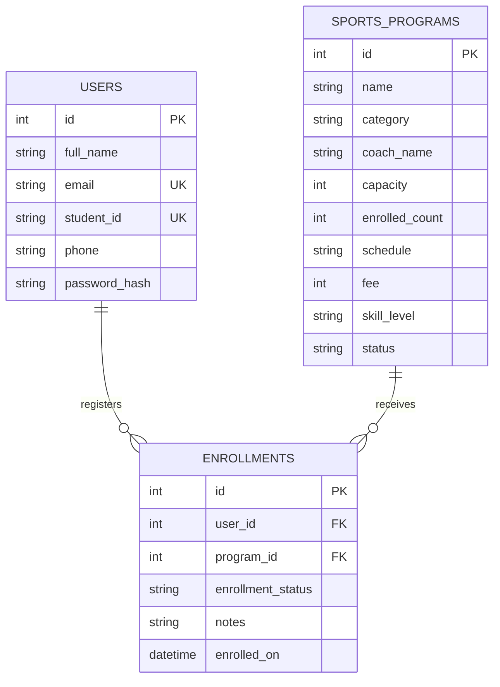

# Architecture Overview

## System Flow

## Database Design

## Concurrency Strategy

- Enrollment writes use a transaction boundary.
- Seat count is checked before insertion.
- Enrollment and seat update happen in the same atomic unit.
- Duplicate enrollment is blocked by logic and uniqueness rules.

